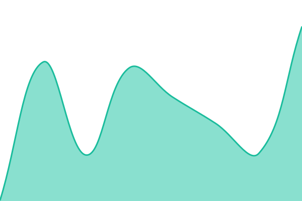
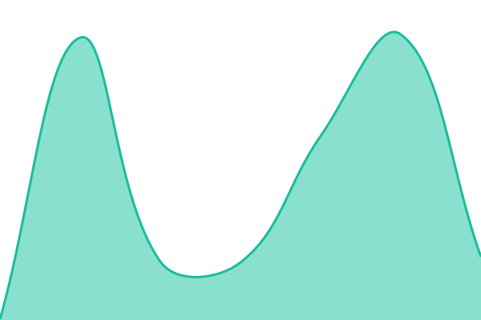
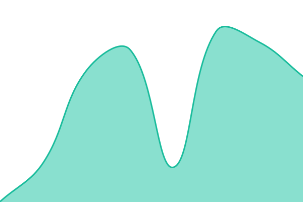

# [📈 Live Status](https://status.pixelrag.ai): <!--live status--> **🟩 All systems operational**

This repository contains the open-source uptime monitor and status page for [StarTrail](https://status.pixelrag.ai), powered by [Upptime](https://github.com/upptime/upptime).

With [Upptime](https://upptime.js.org), you can get your own unlimited and free uptime monitor and status page, powered entirely by a GitHub repository. We use [Issues](https://github.com/StarTrail-org/status/issues) as incident reports, [Actions](https://github.com/StarTrail-org/status/actions) as uptime monitors, and [Pages](https://status.pixelrag.ai) for the status page.

<!--start: status pages-->
<!-- This summary is generated by Upptime (https://github.com/upptime/upptime) -->
<!-- Do not edit this manually, your changes will be overwritten -->
<!-- prettier-ignore -->
| URL | Status | History | Response Time | Uptime |
| --- | ------ | ------- | ------------- | ------ |
|  [Search API](https://api.pixelrag.ai/status) | 🟩 Up | [search-api.yml](https://github.com/StarTrail-org/status/commits/HEAD/history/search-api.yml) | 

 264ms
     
 | 

<a href="https://status.pixelrag.ai/history/search-api">100.00%</a>
    

|  [API Health](https://api.pixelrag.ai/health) | 🟩 Up | [api-health.yml](https://github.com/StarTrail-org/status/commits/HEAD/history/api-health.yml) | 

 221ms
     
 | 

<a href="https://status.pixelrag.ai/history/api-health">100.00%</a>
    

|  [Tile Serving](https://api.pixelrag.ai/tile/0/0/0) | 🟩 Up | [tile-serving.yml](https://github.com/StarTrail-org/status/commits/HEAD/history/tile-serving.yml) | 

 346ms
     
 | 

<a href="https://status.pixelrag.ai/history/tile-serving">100.00%</a>
    

|  [Agent](http://api.pixelrag.ai:30010/health) | 🟩 Up | [agent.yml](https://github.com/StarTrail-org/status/commits/HEAD/history/agent.yml) | 

 164ms
     
 | 

<a href="https://status.pixelrag.ai/history/agent">100.00%</a>
    

|  [Website](https://pixelrag.ai) | 🟩 Up | [website.yml](https://github.com/StarTrail-org/status/commits/HEAD/history/website.yml) | 

 126ms
     
 | 

<a href="https://status.pixelrag.ai/history/website">100.00%</a>
    

<!--end: status pages-->

[**Visit our status website →**](https://status.pixelrag.ai)

## 📄 License

- Powered by: [Upptime](https://github.com/upptime/upptime)
- Code: [MIT](./LICENSE) © [Anand Chowdhary](https://anandchowdhary.com)
- Data in the `./history` directory: [Open Database License](https://opendatacommons.org/licenses/odbl/1-0/)
